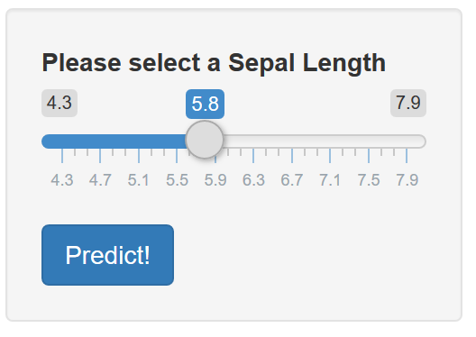
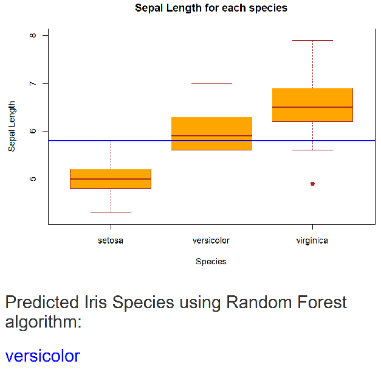

What is the Iris Species?
========================================================
autosize: true
  

CK  
28-April-2019


Objective
========================================================

The shiny application: **speciesPredict** was developed as 
part of final assignmento of: JHU Developing Data Products, 
*Course Project: Shiny Application and Reproducible Pitch*

The application predicts the Iris species given the Sepal Length. 

"iris" dataset in the R *datasets* library is used for this app.

Application hosted on Shiny.io:
<https://kariycha.shinyapps.io/speciespredict/>

ENJOY!!!!

Prediction Algorithm
========================================================

Linear Discriminant Analysis (lda) algorithm is selected along with **caret** library. 

Following is the code snippet that carryout the prediction calculation


```r
library(caret)

set.seed(3456)
fit  <- train(Species ~ Sepal.Length, data=iris,method="lda", ntree=100)
.
.
as.character(predict(fit, newdata = data.frame(Sepal.Length = SepalLenInput)))
```

Input
========================================================

Input the Sepal length by sliding the bar on left panel. The range is 4.3 to 7.9. 
Defautl is 5.8.

One selected press **Predict!** button to get the prediction.



Output
========================================================

Iris species predicted for sepal length inputted is shown in the main panel. 

Also boxplot for each species with respective sepal lenght range is shown. 
Selected sepal length is displayed in the plot with a blue line.

***

